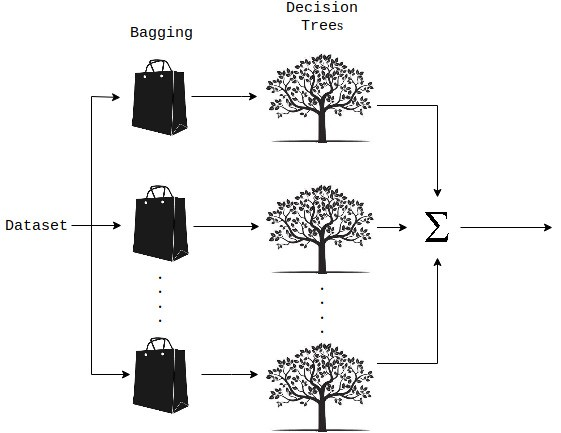
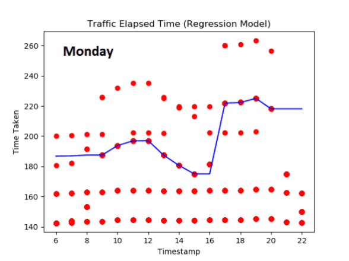
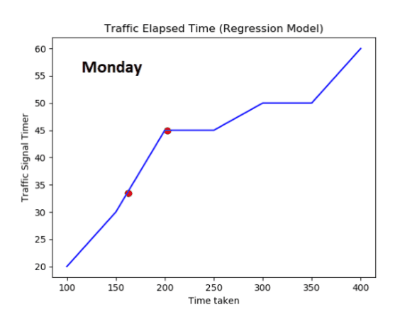

# **Traffic-Signal-Optimization**
Python project that implemented Machine Learning algorithms to optimize the functionalities of the current traffic signal system.

## **Objective**
* The project is aimed at building an efficient system that will help in optimizing the existing traffic signal system.
* It will use a traffic density as the main input parameter and automatically adjust the traffic signal timer accordingly
in a more efficient way.
* The main intention is to primarily remove all hardware required to control traffic signals in order to provide efficient
traffic signal optimization according to the day and the time.

## **Deciding Factors**
* Time of the day
* Day of the week
* Weather conditions
* Temperature

## **Machine Learning Technique used - Random Forest Regression**

In this type of regression, we can observe
* Additive model viz., summation of multiple decision trees 
* Sampling done with replacement ~ Bagging (bootstrap aggregating)

Attached are traffic and signal timer patterns based on the four parameters through the week:

*Graph plotted with time taken (for vehicle to reach from point A to point B across a specific road) vs time of the day*

*Graph plotted with signal timer vs time taken (for vehicle to reach from point A to point B across a specific road)*
